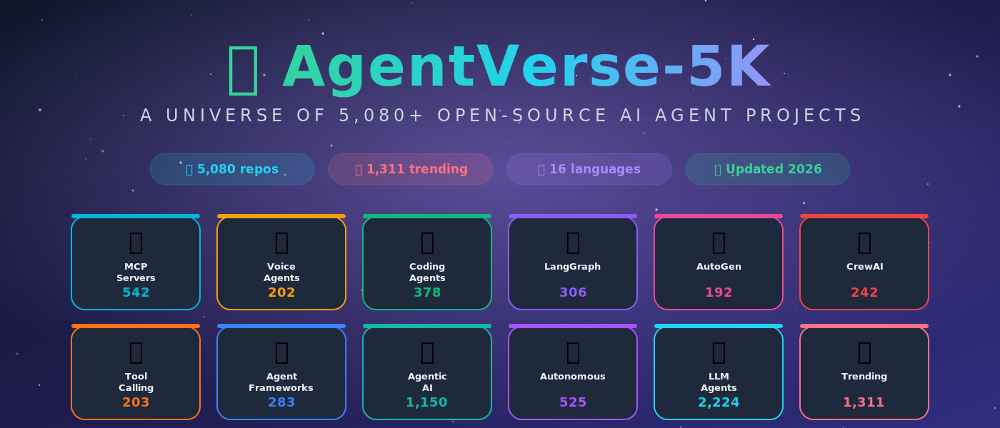

# 🌌 AgentVerse-5K

> **A universe of 5,000+ open-source AI agent projects.**

      

A curated, machine-indexed collection of **5,080 unique open-source AI-agent projects** — spanning MCP servers, voice agents, coding agents, LangGraph, AutoGen, CrewAI, tool-calling frameworks and more. Inspired by [ashishpatel26/500-AI-Agents-Projects](https://github.com/ashishpatel26/500-AI-Agents-Projects), scaled to 10× the size. 🚀

---

## 📋 Table of Contents

- [Introduction](#-introduction)
- [Dataset at a Glance](#-dataset-at-a-glance)
- [Categories](#-categories)
- [By Programming Language](#-by-programming-language)
- [Top 30 Trending Repos](#-top-30-trending-repos)
- [How the List Was Built](#-how-the-list-was-built)
- [Contributing](#-contributing)
- [License](#-license)

---

## 🧠 Introduction

AI agents are the fastest-moving frontier in applied AI: LLMs paired with tools, memory, planning loops and multi-agent orchestration. This index is a one-stop map of what's actually being built right now in public on GitHub.

Each repository is tagged into one or more categories so you can drill down by use case (MCP servers, voice, coding), by framework (LangGraph, AutoGen, CrewAI) or by language. Every row links straight to the source repo.

---

## 📊 Dataset at a Glance

- **Total repositories:** `5,080`
- **With an OSI license:** `3,077` (60%)
- **Pushed in 2026:** `4,388` (86%)
- **Unique primary languages:** `46`

**Top 10 languages**

| Language | Repos | Share |
| -------- | ----- | ----- |
|  | 1,764 | 34.7% |
| Unknown | 992 | 19.5% |
|  | 901 | 17.7% |
|  | 329 | 6.5% |
|  | 316 | 6.2% |
|  | 227 | 4.5% |
|  | 114 | 2.2% |
|  | 97 | 1.9% |
|  | 80 | 1.6% |
|  | 48 | 0.9% |

---

## 🗂️ Categories

Click any category to open its full table.

| Category | Description | Repos |
| -------- | ----------- | ----- |
| 🔌 **[MCP Servers](categories/mcp-servers.md)** | Model Context Protocol servers and clients. | `542` |
| 🎙️ **[Voice Agents](categories/voice-agents.md)** | Speech-first conversational agents and pipelines. | `202` |
| 💻 **[Coding Agents](categories/coding-agents.md)** | Agents that write, edit, review or run code. | `378` |
| 🕸️ **[LangGraph](categories/langgraph.md)** | Agents and workflows built with LangGraph. | `306` |
| 🤝 **[AutoGen](categories/autogen.md)** | Microsoft AutoGen agents and multi-agent systems. | `192` |
| 👥 **[CrewAI](categories/crewai.md)** | Crew-style multi-agent collaboration projects. | `242` |
| 🛠️ **[Tool-Calling Agents](categories/tool-calling.md)** | Function-calling, tool-use, and ReAct style agents. | `203` |
| 🏗️ **[Agent Frameworks](categories/agent-frameworks.md)** | Libraries and frameworks for building agents. | `283` |
| 🤖 **[Agentic AI](categories/agentic-ai.md)** | General agentic-AI applications and demos. | `1,150` |
| 🧭 **[Autonomous Agents](categories/autonomous.md)** | Fully autonomous, goal-driven agents. | `525` |
| 🧠 **[LLM Agents](categories/llm-agents.md)** | General LLM-based agent projects. | `2,224` |
| 🔥 **[Trending (50+ stars)](categories/trending.md)** | Highest-velocity repos in the dataset. | `1,311` |
| 📚 **[All Repositories](categories/all.md)** | Every repo in the dataset. | `5,080` |

---

## 🧬 By Programming Language

| Language | Repos | Table |
| -------- | ----- | ----- |
|  | `1,764` | [Python Agents](categories/lang-python.md) |
|  | `901` | [TypeScript Agents](categories/lang-typescript.md) |
|  | `329` | [Go Agents](categories/lang-go.md) |
|  | `316` | [Rust Agents](categories/lang-rust.md) |
|  | `227` | [JavaScript Agents](categories/lang-javascript.md) |

---

## 🔥 Top 30 Trending Repos

Ranked by star count across the entire dataset.

| Repository | Description | Language | Stars | Code |
| ---------- | ----------- | -------- | ----- | ---- |
| **[n8n-io/n8n](https://github.com/n8n-io/n8n)** | Fair-code workflow automation platform with native AI capabilities. Combine visual building with custom code, self-host or cloud, 400+ integrations. |  |  |  |
| **[Snailclimb/JavaGuide](https://github.com/Snailclimb/JavaGuide)** | Java 面试 & 后端通用面试指南，覆盖计算机基础、数据库、分布式、高并发、系统设计与 AI 应用开发 |  |  |  |
| **[microsoft/markitdown](https://github.com/microsoft/markitdown)** | Python tool for converting files and office documents to Markdown. |  |  |  |
| **[open-webui/open-webui](https://github.com/open-webui/open-webui)** | User-friendly AI Interface (Supports Ollama, OpenAI API, ...) |  |  |  |
| **[farion1231/cc-switch](https://github.com/farion1231/cc-switch)** | A cross-platform desktop All-in-One assistant for Claude Code, Codex, OpenCode, OpenClaw, Gemini CLI & Hermes Agent. Only official website: ccswitch.io |  |  |  |
| **[thedotmack/claude-mem](https://github.com/thedotmack/claude-mem)** | Persistent Context Across Sessions for Every Agent – Captures everything your agent does during sessions, compresses it with AI, and injects relevant context b… |  |  |  |
| **[netdata/netdata](https://github.com/netdata/netdata)** | The fastest path to AI-powered full stack observability, even for lean teams. |  |  |  |
| **[lobehub/lobehub](https://github.com/lobehub/lobehub)** | 🤯 LobeHub is your Chief Agent Operator, organizing your agents into 7×24 operations by hiring, scheduling, and reporting on your entire AI team. |  |  |  |
| **[thedaviddias/Front-End-Checklist](https://github.com/thedaviddias/Front-End-Checklist)** | 🗂 The essential checklist for modern web development, for humans and AI agents |  |  |  |
| **[daytonaio/daytona](https://github.com/daytonaio/daytona)** | Daytona is a Secure and Elastic Infrastructure for Running AI-Generated Code |  |  |  |
| **[shareAI-lab/learn-claude-code](https://github.com/shareAI-lab/learn-claude-code)** | Bash is all you need - A nano claude code–like 「agent harness」, built from 0 to 1 |  |  |  |
| **[nexu-io/open-design](https://github.com/nexu-io/open-design)** | 🎨 Local-first, open-source Claude Design alternative. 🖥️ Native desktop app. ⚡ 259+ Skills · ✨ 142+ Design Systems 🖼️ Web · desktop · mobile prototypes · slide… |  |  |  |
| **[earendil-works/pi](https://github.com/earendil-works/pi)** | AI agent toolkit: unified LLM API, agent loop, TUI, coding agent CLI |  |  |  |
| **[code-yeongyu/oh-my-openagent](https://github.com/code-yeongyu/oh-my-openagent)** | omo/lazycodex: The coding agent for tokenmaxxers;the one and only agent harness for complex codebases. For your Codex, for your OpenCode |  |  |  |
| **[sansan0/TrendRadar](https://github.com/sansan0/TrendRadar)** | ⭐AI-driven public opinion & trend monitor with multi-platform aggregation, RSS, and smart alerts.🎯 告别信息过载，你的 AI 舆情监控助手与热点筛选工具！聚合多平台热点 + RSS 订阅，支持关键词精准筛选。AI 智能筛… |  |  |  |
| **[ruvnet/ruflo](https://github.com/ruvnet/ruflo)** | 🌊 The leading agent meta-harness for Claude. Deploy intelligent multi-agent swarms, coordinate autonomous workflows, and build conversational AI systems. Featu… |  |  |  |
| **[shanraisshan/claude-code-best-practice](https://github.com/shanraisshan/claude-code-best-practice)** | from vibe coding to agentic engineering - practice makes claude perfect |  |  |  |
| **[upstash/context7](https://github.com/upstash/context7)** | Context7 Platform -- Up-to-date code documentation for LLMs and AI code editors |  |  |  |
| **[MemPalace/mempalace](https://github.com/MemPalace/mempalace)** | The best-benchmarked open-source AI memory system. And it's free. |  |  |  |
| **[FlowiseAI/Flowise](https://github.com/FlowiseAI/Flowise)** | Build AI Agents, Visually |  |  |  |
| **[santifer/career-ops](https://github.com/santifer/career-ops)** | AI-powered job search system built on Claude Code. 14 skill modes, Go dashboard, PDF generation, batch processing. |  |  |  |
| **[aaif-goose/goose](https://github.com/aaif-goose/goose)** | an open source, extensible AI agent that goes beyond code suggestions - install, execute, edit, and test with any LLM |  |  |  |
| **[CherryHQ/cherry-studio](https://github.com/CherryHQ/cherry-studio)** | AI productivity studio with smart chat, autonomous agents, and 300+ assistants. Unified access to frontier LLMs |  |  |  |
| **[mudler/LocalAI](https://github.com/mudler/LocalAI)** | LocalAI is the open-source AI engine. Run any model - LLMs, vision, voice, image, video - on any hardware. No GPU required. |  |  |  |
| **[jeecgboot/JeecgBoot](https://github.com/jeecgboot/JeecgBoot)** | AI 低代码平台「低代码 + 零代码」双驱动！低代码可一键生成前后端代码;零代码可 5 分钟搭建系统;AI Skills 一句话画流程、设计表单、生成整套系统。内置 AI聊天、知识库、流程编排、MCP插件等，兼容主流大模型。引领「AI 生成 → 在线配置 → 代码生成 → 手工合并->AI修改」开发模式，消除 Jav… |  |  |  |
| **[zhayujie/CowAgent](https://github.com/zhayujie/CowAgent)** | Open-source super AI assistant & Agent Harness. Plans tasks, runs tools and skills, self-evolves with memory and knowledge. Multi-model, multi-channel. Lightwe… |  |  |  |
| **[siyuan-note/siyuan](https://github.com/siyuan-note/siyuan)** | A privacy-first, self-hosted, fully open source personal knowledge management software, written in typescript and golang. |  |  |  |
| **[HKUDS/nanobot](https://github.com/HKUDS/nanobot)** | Lightweight, open-source AI agent for your tools, chats, and workflows. |  |  |  |
| **[ChromeDevTools/chrome-devtools-mcp](https://github.com/ChromeDevTools/chrome-devtools-mcp)** | Chrome DevTools for coding agents |  |  |  |
| **[Kong/kong](https://github.com/Kong/kong)** | 🦍 The API and AI Gateway |  |  |  |

---

## 🛠️ How the List Was Built

- Queried the GitHub Search API across **54 distinct topic / keyword filters** (`topic:ai-agent`, `topic:mcp-server`, `topic:langgraph`, language-scoped queries, etc.).
- Filtered to repos pushed since **2026-01-01** with at least minimal activity.
- De-duplicated by `owner/repo` to produce **5,080 unique entries**.
- Each entry is bucketed into one or more of the categories above using a rule-based classifier over `source_query`, `description` and `language`.
- Rendered as Markdown tables, one file per category, linked from this README.

Source data: `repos_5080_all_unique.json` (included as the upstream dataset).

---

## 🤝 Contributing

PRs welcome! To add or correct a repo:

1. Fork the repo.
2. Edit the matching file in `categories/`.
3. Open a pull request — keep the table format intact.

See [CONTRIBUTING.md](CONTRIBUTING.md) for details.

## 📜 License

This index is released under the [MIT License](LICENSE). Each linked repository retains its own license.

---

⭐ **Star this repo** if it helped you find your next agent project.
